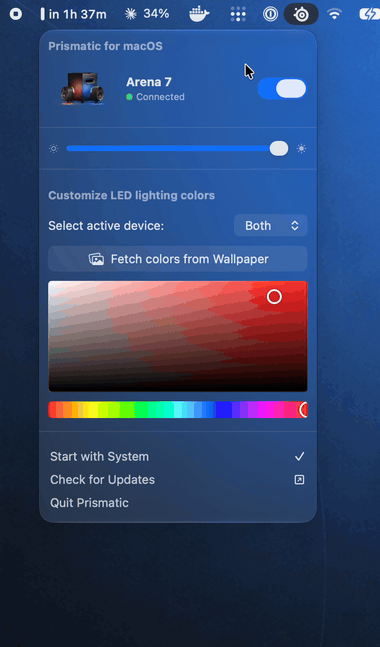

<div align="center">


# Prismatic for macOS

### Control your **SteelSeries Arena 7** RGB from the macOS menu bar — no SteelSeries GG required.

[](https://github.com/szamski/Prismatic-for-macOS/actions/workflows/ci.yml)
[](https://www.apple.com/macos/)
[](https://developer.apple.com/xcode/swiftui/)
[](LICENSE)
[](https://github.com/szamski/Prismatic-for-macOS/releases/latest)
[](https://github.com/szamski/Prismatic-for-macOS/releases)
[](https://github.com/szamski/Prismatic-for-macOS/stargazers)

</div>

---

Prismatic is a tiny, native macOS menu-bar app that drives the RGB lighting on
**SteelSeries Arena 7** speakers **directly over USB HID** — so you don't need the
heavy SteelSeries GG suite running in the background. Pick left/right colors, pull a
palette straight from your wallpaper, dim, and toggle — all from the menu bar.

<div align="center">



</div>

## Features

- **Independent left / right colors** — each speaker drives 2 of the Arena's 4 RGB zones
- **Fetch colors from your wallpaper** — extracts a dominant-color palette in one click
- **Hardware brightness** and instant **on/off**
- **Custom inline color picker** — works right inside the menu (no clunky system panels)
- **No SteelSeries GG needed** — talks to the speakers directly over USB
- **Launch at login**, built-in **update check**, ~1 MB native SwiftUI app

## Why?

SteelSeries GG is a multi-hundred-megabyte Electron + background-service suite just to
change a color. Prismatic does the one thing — lighting — natively, instantly, and out
of your way. The USB protocol was **reverse-engineered** so the app can talk to the
hardware on its own ([see how it works](#how-it-works)).

## Install

### Homebrew

```sh
brew install szamski/tap/prismatic
```

### Manual

Download the latest **[`Prismatic.dmg`](https://github.com/szamski/Prismatic-for-macOS/releases/latest)**, open it, and drag **Prismatic.app** into **Applications**. A plain **`Prismatic.zip`** is attached to each release too.

## Usage

1. Connect the **Arena 7 over USB** (lighting is USB-only — Bluetooth won't do it).
2. **Quit SteelSeries GG** if it's running (both can't own the device at once).
3. Launch Prismatic — the menu-bar icon appears. Pick colors, brightness, done.

## How it works

The Arena 7 exposes a vendor HID interface (`UsagePage 0xFFC0`, VID:PID `0x1038:0x1A00`).
Lighting is set with an **Output report, ID `0x06`** (sent as a control `SET_REPORT`):

```text
byte 0 : 0x06            report ID
byte 1 : 0xA1            command (0xA1 = set static colors, 0x09 = off)
byte 2…: 4 × zone        each zone = [R, G, B, 0x01, 0x1E, brightness(0…10)]
                         zone order: left-base, left-rear, right-base, right-rear
…0x0F  : terminator
```

The protocol was recovered from a USBPcap capture of SteelSeries GG. See
[`ArenaUSBController.swift`](prisma-led-macos/ArenaUSBController.swift) for the
implementation and [`tools/`](tools/) for the HID diagnostic scripts used during RE.

## Build from source

```sh
git clone https://github.com/szamski/Prismatic-for-macOS.git
cd Prismatic-for-macOS
xcodebuild -project prisma-led-macos.xcodeproj -scheme Prismatic -configuration Release build
```

Requires a full **Xcode** (not just the Command Line Tools).

### Releasing (maintainers)

Prismatic ships **signed with a Developer ID certificate, built with the Hardened
Runtime, and notarized**, so it runs with no Gatekeeper warnings.

**One-time:** add a **Developer ID Application** certificate (Xcode → Settings → Accounts →
Manage Certificates → click **+** → *Developer ID Application*) and sign in with your paid team.

#### Option A — Xcode (simplest)

1. **Product → Archive**.
2. In the **Organizer**, choose **Distribute App → Direct Distribution**. Xcode signs with
   Developer ID + Hardened Runtime, notarizes through your signed-in account, and staples
   the ticket — all in the GUI.
3. Export the app, then zip it for the release:
   ```sh
   ditto -c -k --keepParent Prismatic.app Prismatic.zip && shasum -a 256 Prismatic.zip
   ```

#### Option B — Scripted (for CI)

`scripts/notarize.sh` does the same headless (archive → Developer ID sign → notarize →
staple → zip → sha256). It needs a `notarytool` credential profile named `prismatic`:

```sh
xcrun notarytool store-credentials prismatic \
  --apple-id "you@example.com" --team-id CKWYP7CT7C --password <app-specific-password>
```

Either way: upload `Prismatic.zip` to a GitHub release tagged `v<version>` and bump
`version` + `sha256` in [`Casks/prismatic.rb`](Casks/prismatic.rb).

## Contributing

Issues and PRs are welcome.

### Adding support for a new device

Prismatic can likely drive **any SteelSeries device that SteelSeries GG lights up** — it
just needs its USB lighting protocol reverse-engineered. The
**[New device support issue](../../issues/new?template=new-device.yml)** form collects
everything below; here's the full picture of what's involved.

**What to provide**

1. **The device** — exact model name, and confirmation that SteelSeries GG can change its
   lighting on your machine (that's how we know it's a GG-managed device).
2. **USB identifiers + HID layout** — run `swift tools/hid-probe.swift` with the device
   connected and paste the output. It prints the `VID:PID`, the vendor usage page, and the
   report IDs with their Input / Output / Feature sizes — i.e. *which* HID report is most
   likely the lighting channel.
3. **A USBPcap capture — the one thing that unlocks everything.** On a Windows PC with the
   device connected over USB:
   - Install **Wireshark** (tick **USBPcap** in the installer) and **SteelSeries GG**.
   - Start capturing on the USBPcap interface that carries VID `1038`.
   - In GG, set the lighting to **static, full brightness**, and walk through a known
     sequence with ~2 s gaps: **all red → all green → all blue → each zone a different
     color → off**.
   - Stop, **Save As** a `.pcapng`, zip it, and attach.

   That capture contains the exact `SET_REPORT` packets GG sends, which reveal the **report
   ID**, the **command byte**, the **per-zone byte layout**, and the **RGB order** — exactly
   how the Arena 7 was decoded.
4. **Zone layout** — how many independently-addressable zones there are and where (e.g.
   "4 zones: a base ring + a rear cluster on each of the two speakers"), so the app can map
   colors to the right physical LEDs.
5. **Environment** — your macOS version and whether you're on Apple Silicon or Intel.

**How it then gets implemented**

1. Decode the capture: locate the lighting transfer (`bmRequestType 0x21`, `bRequest 0x09`),
   read the data bytes, and work out the frame — `[report id][command][zone data…][terminator]`
   plus any brightness / effect bytes.
2. Verify it live: send candidate reports with `tools/led-probe.swift` and watch the device
   (a stalled write means the frame is wrong; an accepted one means it's right).
3. Add a small device profile — USB IDs, report id, command, zone map — modeled on
   [`ArenaUSBController.swift`](prisma-led-macos/ArenaUSBController.swift), and wire the
   app's left / right (or per-zone) colors onto it.

**No Windows machine?** Open the issue anyway with the `hid-probe` output. Without a capture
it's slower (the byte layout has to be inferred), but it's often still possible.

## Disclaimer

Prismatic is **unofficial** and not affiliated with or endorsed by SteelSeries. The USB
protocol was reverse-engineered for interoperability. Use at your own risk.

## License

[MIT](LICENSE) © 2026 Maciej Szamowski

<div align="center">

SteelSeries, Arena, and PrismSync are trademarks of their respective owners.

</div>
